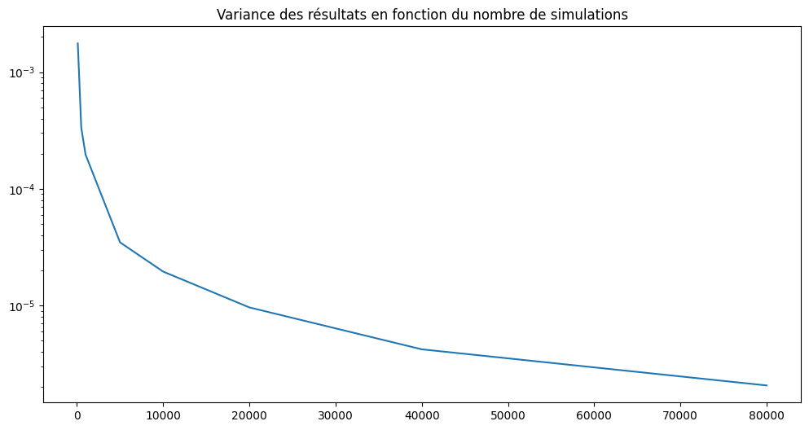

# Go Poker

API pour l'évaluation de main au poker.

## Utilisation

### Lancer l'API
```
go run .
```


### Examiner une main
```
curl localhost:8080/evaluate --data '{"personal_cards": ["As de coeur", "As de piques"], "common_cards": []}'
```

- personal_cards : Liste des cartes dans votre main (2 obligatoires)
- common_cards : Liste des cartes partagées. La liste sera complétée aléatoirement s'il y a moins de 5 cartes

## Méthode

L'API utilise des simulations de Monte-Carlo pour simuler un grand nombre de partie avant de mesurer la fréquence de victoire. L'algorithme se base sur les données fournies et complète les cartes manquantes en tirant des cartes au hasard comme dans le cadre d'une vraie partie.

### Nombre de simulations
Par défaut le programme utilise 5 000 simulations pour calculer la probabilité de victoire; cependant le nombre de tirages à une influence significative sur la stabilité des probabilités calculées.
Cette influence a été quantifiée en mesurant la variance des résultats en fonction du nombre de tirage réalisé.


